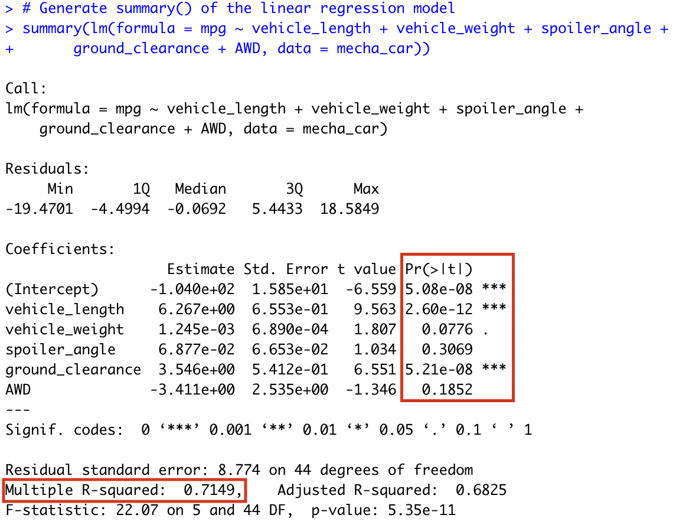
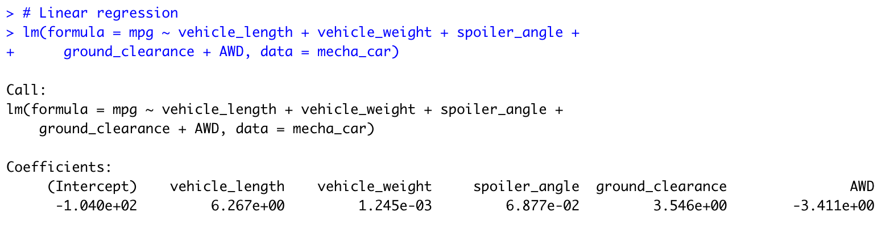
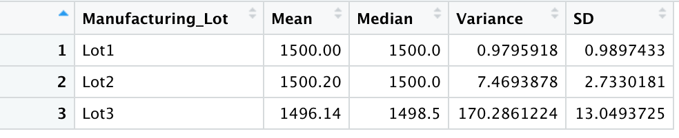
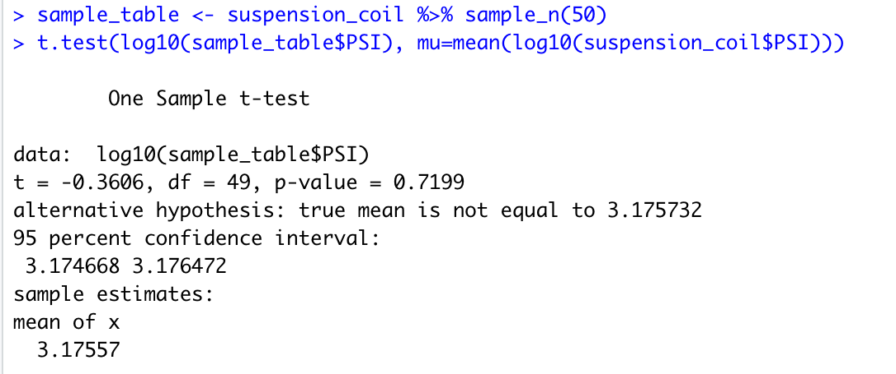
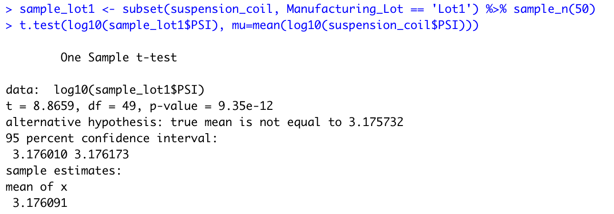
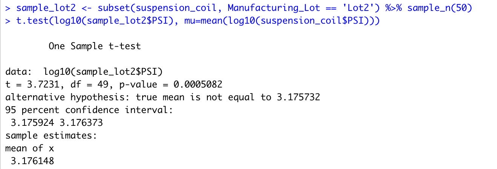

# MechaCar_Statistical_Analysis
## Linear Regression to Predict MPG

  Using the summary of the linear regression model, pictured below, we can assume that mpg is affected by several non-random factors. I’ve come to this conclusion by analyzing the P-value of each variable, labeled in the image as Pr(>|t|) and highlighted in a red box.

  According to these P-values, assuming that the significance level is equal to 0.05, we have sufficient evidence to reject a null hypothesis and acknowledge they provide a statistical difference :

The vehicle length having a p-value of 2.60e-12
The ground clearance having a p-value of 5.21e-08

  In the image of the Linear regression results (below) we have evidence that the slope of the linear model is not zero. Each variable contributes a coefficient value representing the impact that the variable has on the depends variable, mpg. Plugging the coefficient values into the linear regression equation gives the following linear regression model:

Mpg = 6.267 vehicle_length + .001245 vehicle_weight + .06877 spoiler_angle + 3.546 ground_clearance - 3.411 AWD - 104

  From the Multiple R-squared value we can conclude that 71.5% of the variability in MPG can be accounted for by the linear regression model. This is sufficient evidence to show that this linear model can predict the mpg of prototypes effectively. 

## Summary Statistics on Suspension Coils

  As seen in the total summary table pictured below, the variance of all manufacturing lots of suspension coils is approximately 62.29 pounds per square inch. This meets the required design specification, which is a variance value below 100 pounds per square inch.

  However, when I breakdown this data and observe the variance of each manufacturing lot it appears that one of the manufacturing lots is far above the required variance value. The results of this analysis can be seen in the lot summary table pictured below. 

  Lot 1 and Lot 2 are far below the limit with variance values of 0.98 and 7.47, respectively. 
  Lot 3 is much higher than the required limit, with a variance value of 170.29. It is possible that the data recorded from this manufacturing lot skewed the results in the total summary table, above. 

## T-Tests on Suspension Coils

  After performing 4 t-tests on the suspension coil data I was able to find evidence that 2 of the manufacturing lots  introduced a statistical difference while one of the manufacturing lots did not. 

  When testing a sample of 50 random entries from the entire dataset I observed a p-value of 0.7199. Since this value is greater than the significance level of 0.05, we would fail to reject the null hypothesis and consider there is no statistical difference.

  Additionally, when performing the t-test on a sample of 50 random entries from a subset of the dataset having manufacturing lot 3 I observed a p-value of 0.1549. Since this is also greater than the significance level of 0.05, we would fail to reject the null hypothesis and consider there is no statistical difference between samples from manufacturing lot 3 and the total dataset.

  However, when performing the t-test on samples yield from manufacturing lots 1 and 2 I observed p-values that suggested there is a statistical difference in these subsets.

  When performing the t-test on a sample of 50 random entries from a subset of the dataset having manufacturing lot 1 I observed a p-value of 9.35e-12. Since this is much smaller than the significance level of 0.05, we would reject the null hypothesis, suggesting that there is a statistical difference between samples from manufacturing lot 1 and the total dataset.

  When performing the t-test on a sample of 50 random entries from a subset of the dataset having manufacturing lot 2 I observed a p-value of 5.082e-4. Since this is much smaller than the significance level of 0.05, we would reject the null hypothesis, suggesting that there is a statistical difference between samples from manufacturing lot 2 and the total dataset.

## Study Design: MechaCar vs Competition

  From the statistical analysis we have sufficient evidence to suggest that manufacturing lots 1 and 2 introduce a statistical difference from our total dataset. To further investigate the vehicle performance of cars having MechaCar suspension coils I would perform a few additional tests. 
I would study the safety rating of vehicles having MechaCar suspension coils, compared to vehicles that do not have MechaCar manufactured parts. To incorporate the statistical results found in this study I would also compare the safety rating of vehicles having manufacturing lots 1 and 2.

  The null hypothesis for this study would be that there is no statistical difference between the data recorded from  MechaCar manufactured vehicles and that of cars manufactured by other companies. The two groups would have very similar safety ratings. 
  The alternative hypothesis would be that there is a statistical difference between the data of MechaCar manufactured vehicles and that of cars manufactured by other companies. MechaCar manufactured vehicles would either have greater safety ratings or poor safety ratings, compared to cars manufactured by other companies. 

  To perform this study I would want to gather data about accidents that these cars have been involved in and the severity of injuries sustained by the drivers and passengers, in addition to the suspension coil data that we already have. 

  To analyze the statistical differences I would ensure that the datatypes for my new variables are numerical and interval. This would serve as a scale with the lower end of the scale representing less severe accidents and injuries. Using this scale I would perform ANOVA testing, complete with boxplots to show which manufacturers vehicles tend to be safer. I would compare how the severity of injuries compare to the severity of accidents to get an idea of which vehicles provide more protection to the passangers.  
  To take into account any other variables involved with these incidents I would repeat the linear model testing to see how the other factors in this dataset affect the new data. 
